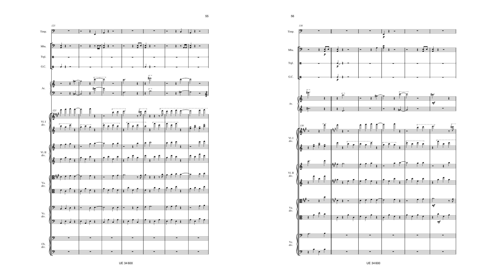
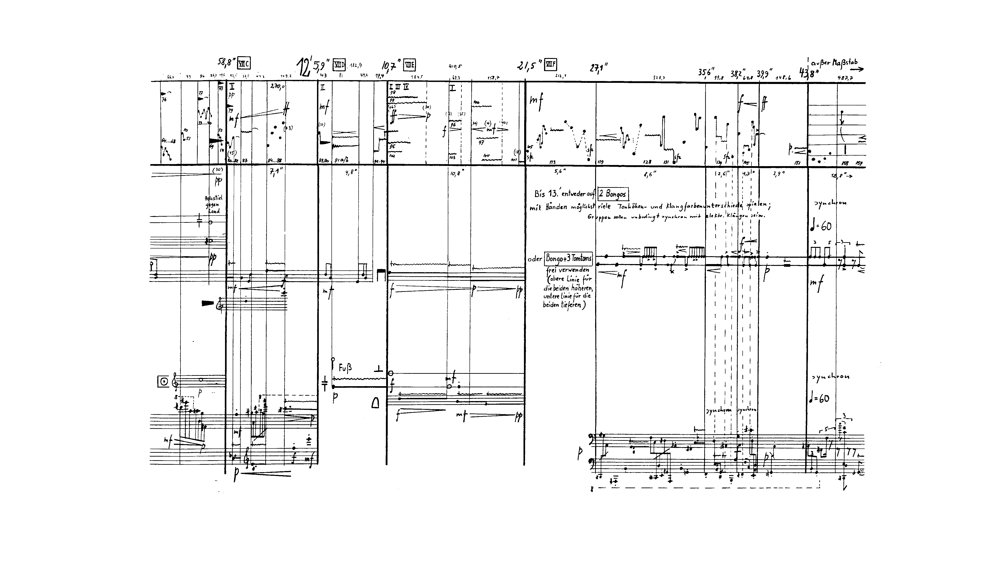

# ScrollingScore
---
## Background Examples
Used to automate a large part of the image editing in making scrolling score sheet music videos, specifically to maximize the number of systems per slide within the constraints of a 16:9 resolution.
See usage on my YouTube channel [here](https://www.youtube.com/jleightcap).


<center>Split output: <i>Pärt - Symphony No. 4</i></center>


<center>-single flag output: <i>Stockhausen - Kontakte</i></center>

## Requirements
- Python3. Install Python 3.x and run `python3 --version` to verify your installation.
- PIL (Python Imaging Library). Using pip, `pip install Pillow`.
## Usage
Clone this repo into a new folder. You can download a .zip from [here](https://github.com/jleightcap/ScrollingScore), or with git
```
git clone https://github.com/jleightcap/ScrollingScore
```
Place images you want made into slides in the `./Sheets` directory, so that in total the directory looks like
```
├── main.py
├── README.md
└── Sheets
    ├── image1.png
    ├── ...
    └── imageN.png
```
Execute the program with
```
python3 main.py [flags]
```
and the resulting prepared slides directory will look like
```
├── main.py
├── README.md
├── Sheets
│   ├── image1.png
│   ├── ...
│   └── imageN.png
└── Slides
    ├── 1.png
    ├── ...
    └── n.png
```
### Flags
- `-h`: help, print this README
- `-q`: quiet, don't display status
- `-single`: export each image to an individual slide, rather than combining tall pages
### Considerations
- The slides are prepared in _alphabetical order_. This is most often a constant name with an increasing number like `Image001.png -> Image002.png -> ... -> ImageN.png`.
## Todo
- Improve the messages displayed during conversion, with a status bar.
- Potential rewrite in C++.
- Add direct PDF support/hooks
- Add `-single` for specific page ranges (separate title slides for first few pages, for example)
- Image straightening/partitioning (Knuth-Plass line wrapping)
